# Tailorfinder

# 更新tips：

优化了公司子域名ip138指纹标题乱码问题，美化了前端 参考了该项目（直接抄代码）https://github.com/timwhitez/Frog-checkCDN 新增cdn识别功能（可以开启关闭）
-iscdn 默认为False


一款方便懒人对企业资产自动化收集工具,因为避免重复造轮子，所以收集过程中用到了一些已经有的工具故取名裁缝-Tailorfinder 

收集的结果有子域名,c段,控股子公司，子公司及主公司主域名，邮箱,app资产，web资产指纹识别，masscan+nmap扫描结果

nmap，masscan ，xsltproc请大家自行安装，只支持linux，mac版本，windows不支持了 Masscan 版本 1.3.2 

检查一下终端命令行是否可以执行nmap,masscan,xlstproc命令

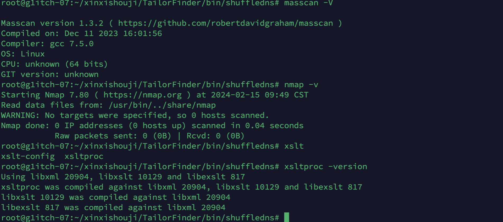


流程如下

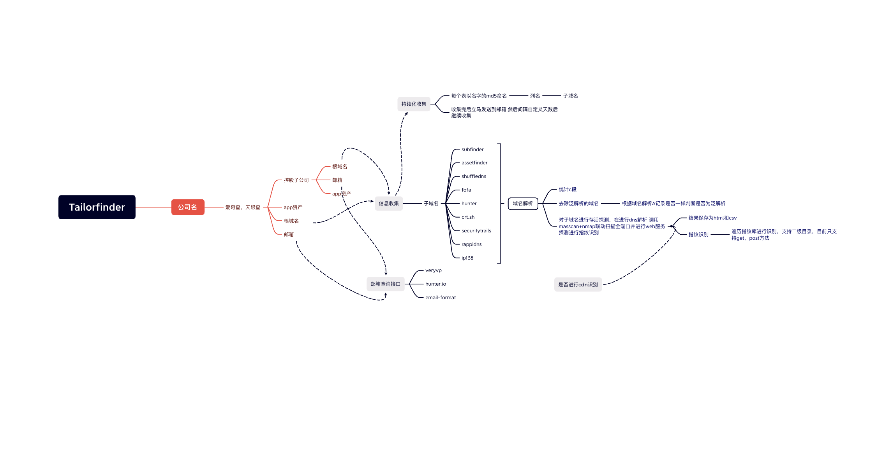


结合以下信息收集工具


https://github.com/projectdiscovery/subfinder

https://github.com/tomnomnom/assetfinder

https://github.com/projectdiscovery/shuffledns


shuffledns 需要自行编译massdns

https://github.com/blechschmidt/massdns

已经为大家编译好了 开箱即用


linux，mac 记得去bin目录下先加下执行权限
以上工具自带，不需要自行编译安装


子域名收集api接口

fofa

hunter

securitytrails

rapiddns.io

crt.sh

ip138


邮箱查询网址
veryvp
hunter.io
www.email-format.com


指纹识别

参考该项目指纹识别库 2W+：

https://github.com/lemonlove7/EHole_magic

新增二级目录指纹识别，在finger/finger.json，可自行添加

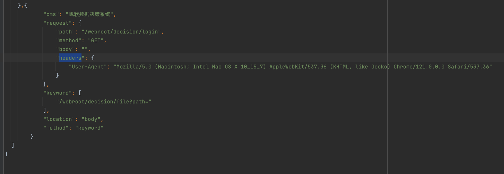

支持自定义命令参数 在config.py里

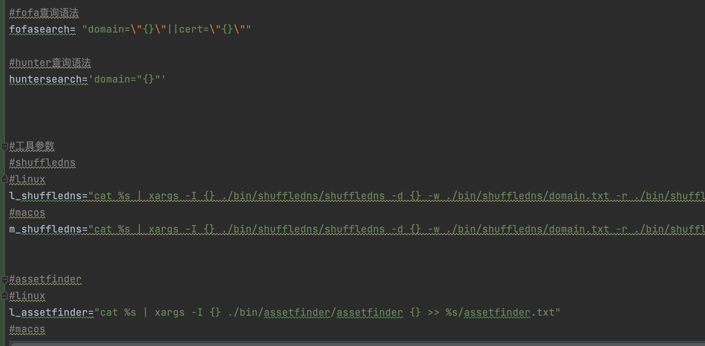

# 使用前准备

shuffledns需要结合massdns使用请参考其github进行配置，二进制运行文件在bin目录下


配置config.py里的cookie

准备fofo，hunter，SecurityTrails, hunteremailkey,爱奇查,天眼查 的key或者cookie

注意爱奇查有时会报错，有人机识别，自己浏览器重新访问一下过一下人机识别就好，建议本机搜集相关公司信息，服务器搜集子域名web，c段信息

天眼查记得配置X-AUTH-Token 搜索branchlist接口配置，有些接口需要token

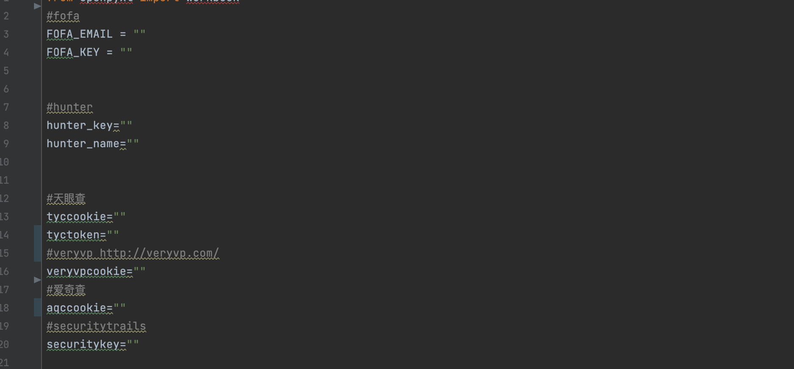

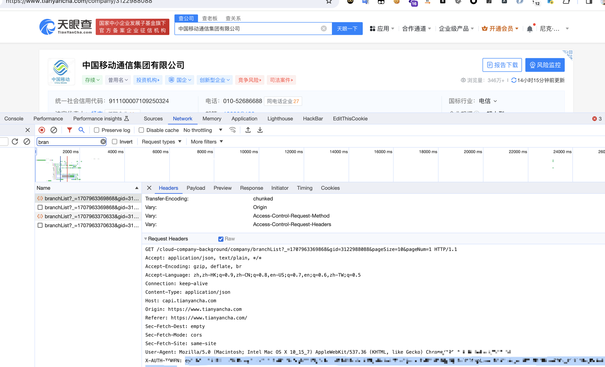

配置完成后

pip3 install -r requirements.txt

```
python3 main.py -h
```

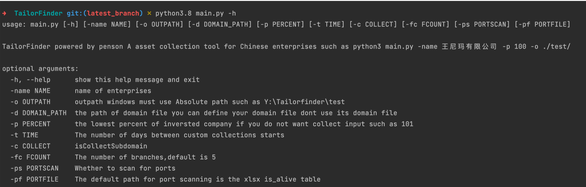

# 使用方法及参数

## 搜集公司相关信息

```
python3.8 main.py -name 公司名称  -p 控股子公司的百分比 -fc 搜集分支机构数量上限 -o 输出保存路径
```

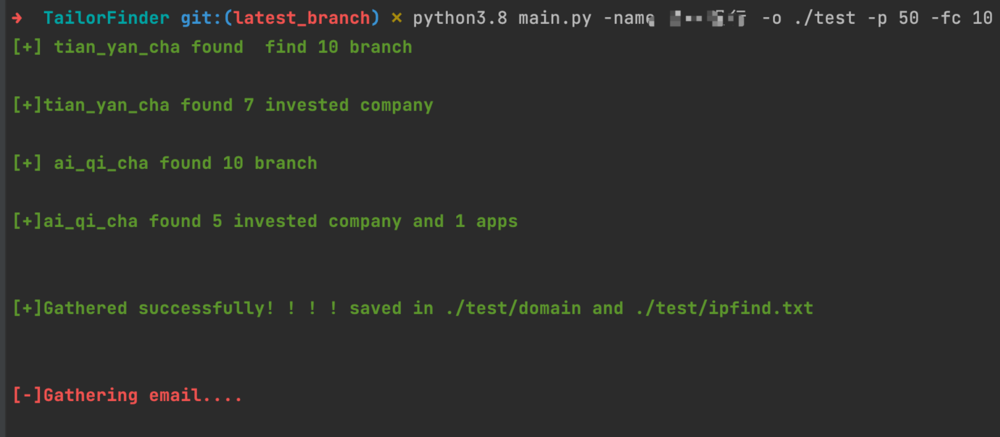

公司根域名结果

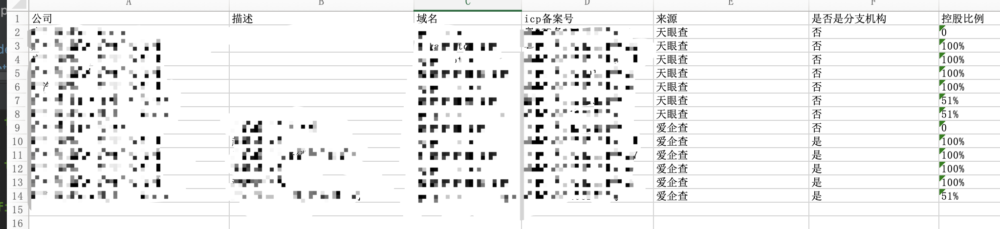

公司股份结果

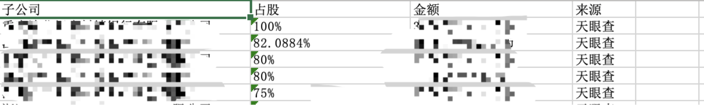

旗下app


邮箱

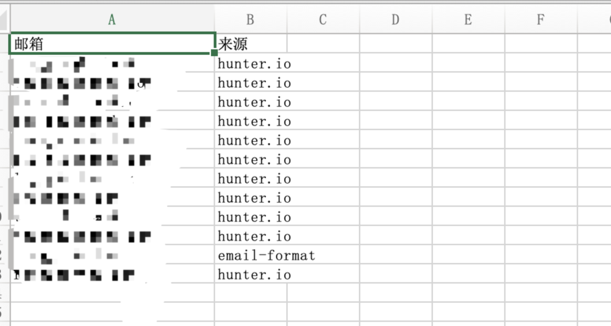


## 搜集子域名

建议搜集子域名放服务器上跑，因为内置子域名字典达到180w+，速度比较慢

```
python3.8 main.py -name 王尼玛有限公司 -o ./test -d ./test/domain
```

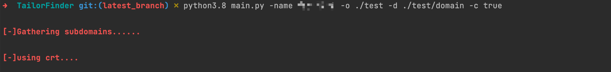

结果会把各个工具接口搜集的结果汇集到各个表格中，其中alldomain汇总了所有的子域名，alive_domain汇总了所有的存活子域名，all_ip,fofa_ip,hunter_ip汇总了c段的ip次数。


## 端口web指纹搜集

公司名称要和上面搜集子域名的保存得到xlsx表格名一致，例如: 搜集子域名后保存为王尼玛有限公司.xlsx，则公司名称为王尼玛有限公司

```
python3.8 main.py -name 公司名称 -o 输出保存路径 -ps true
```

也可以自定义表格，只需要满足格式即可，从alive_domain表里取域名

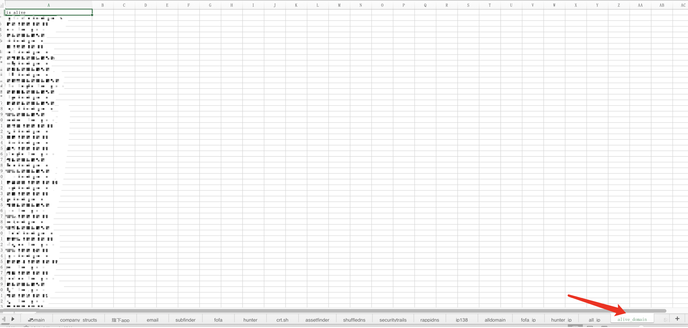

```
python3.8 main.py -name 公司名称 -o 输出保存路径 -ps true -pf 表格名称(/test/王尼玛有限公司.xlsx,记得带绝对路径)
```


搜集完后，会将端口搜集结果保存为Portdetail.csv,web指纹收集结果保存名字为输入的公司名+_web.html

详情如下

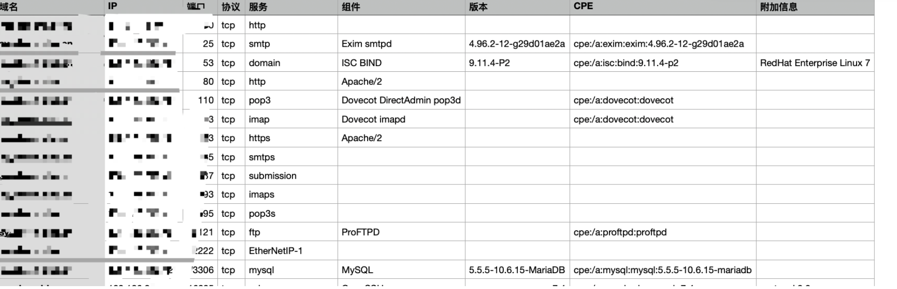

指纹识别信息，如果没有找到ip对应的域名，则域名为ip

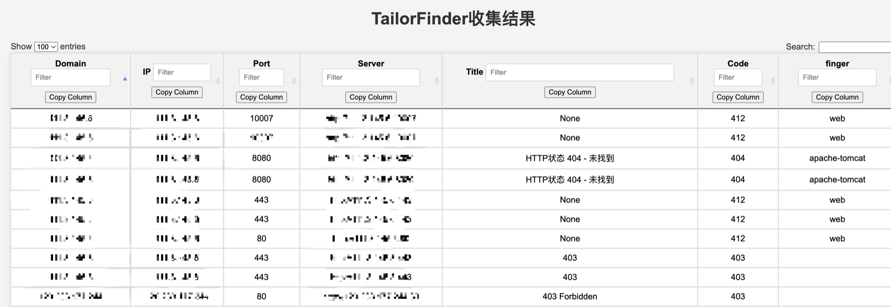


当然也可以一把命令梭哈

```
python3.8 main.py -name 公司名称  -p 控股子公司的百分比 -fc 搜集分支机构数量上限 -o 输出保存路径 -c true -ps true
```


# 定时任务

-t 参数设置每次收集的间隔时间，单位（天），并发送邮箱（ config.py配置好你的邮箱）


如果大家有更好的工具或者api接口，欢迎联系g1itch_ctf@yahoo.com，我会放到裁缝里

